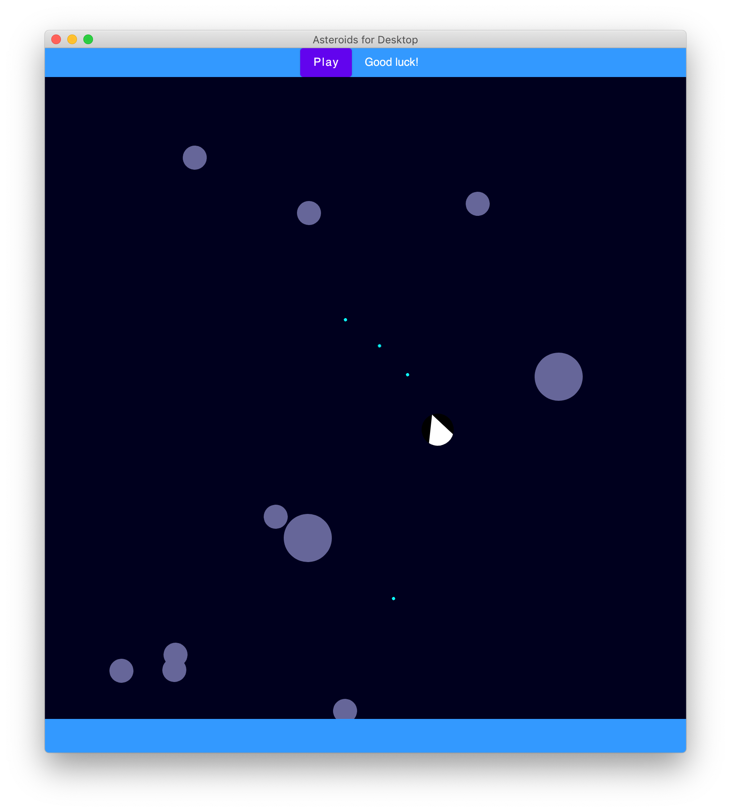

# Asteroids, built with Compose for Desktop

### Want to learn how I built it?
### Read the [two-part article](https://dev.to/kotlin/how-i-built-an-asteroids-game-using-jetpack-compose-for-desktop-309l) in which I describe the most interesting parts of this project.

`asteroids-compose-for-desktop` is a basic experiment of building a 2D space game on top of [Compose for Desktop](https://www.jetbrains.com/lp/compose/). 🚀 Run with `./gradlew run`. Feel free to explore, and enjoy! 🌕

- First change use the spacebar to shoot
- Adding controls to speed up and slow down the ship
- Added graphics from opengameart.org artists
- Added points
- Added energy
- Added interface Animable
- Added animations rocket

- For the background:
[Westbeam](https://opengameart.org/content/space-background-1#:~:text=Author%3A%C2%A0-,Westbeam,-Sunday%2C%20April%2014)

- For the rest of the graphics
[Kenney](  https://opengameart.org/users/kenney)
[Space Shooter art pac](https://opengameart.org/content/space-shooter-redux)
 
 ## Graphics now
 

https://claude.site/artifacts/5153259b-e69b-4840-a4e9-4974813c92da

https://claude.site/artifacts/924a0201-378b-42f7-839a-40b4a5b5650c

https://claude.site/artifacts/0e0169af-7385-4de5-914b-543c7e6d3ad0

https://claude.site/artifacts/8531a18b-8925-4f11-a46e-cb00fb747a80

https://claude.site/artifacts/4e7997f1-aa1f-4715-a2f3-0d6caa45dd64

https://claude.site/artifacts/b29cec09-40e4-4633-8ad2-d8b8aed3cb2c
